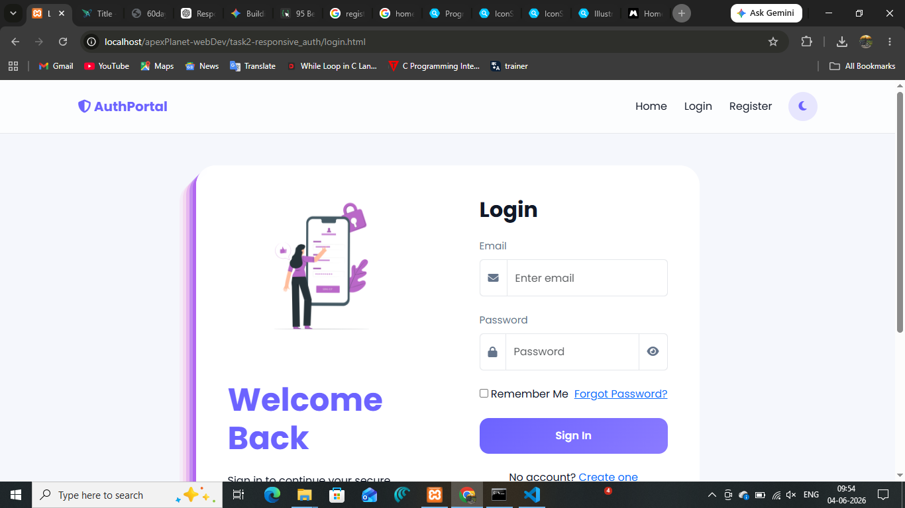
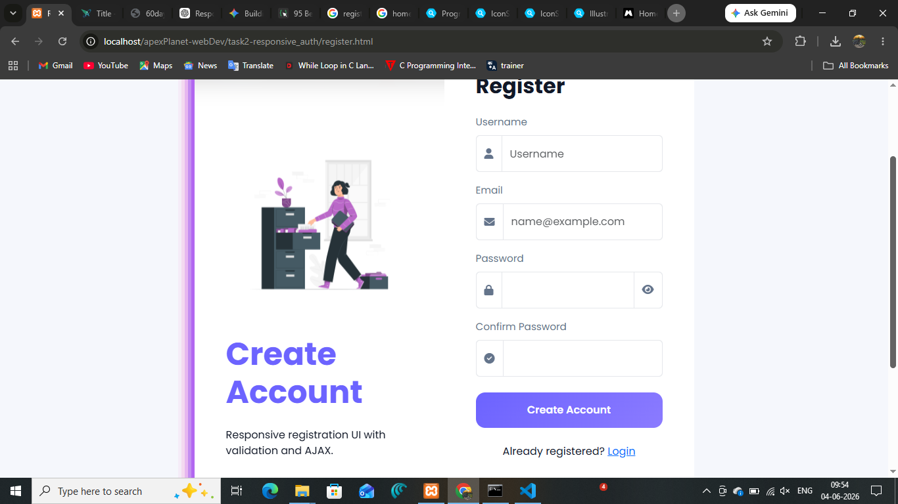
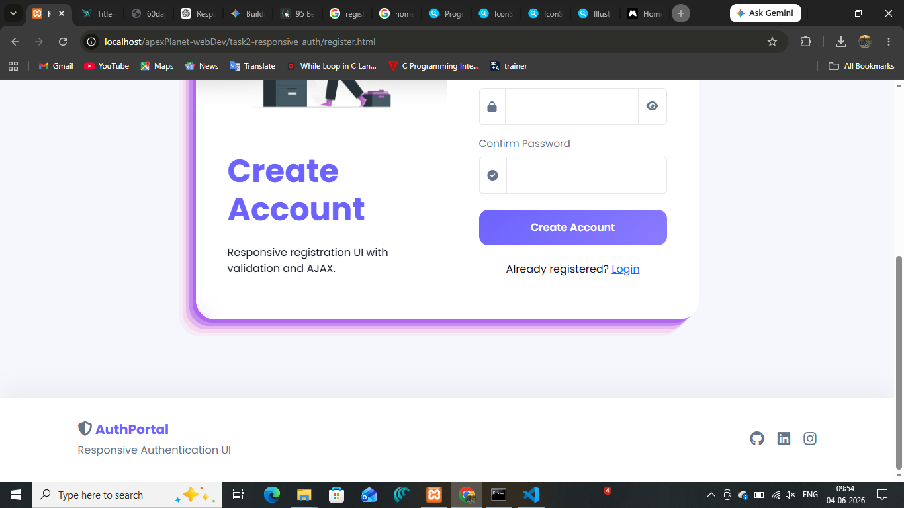
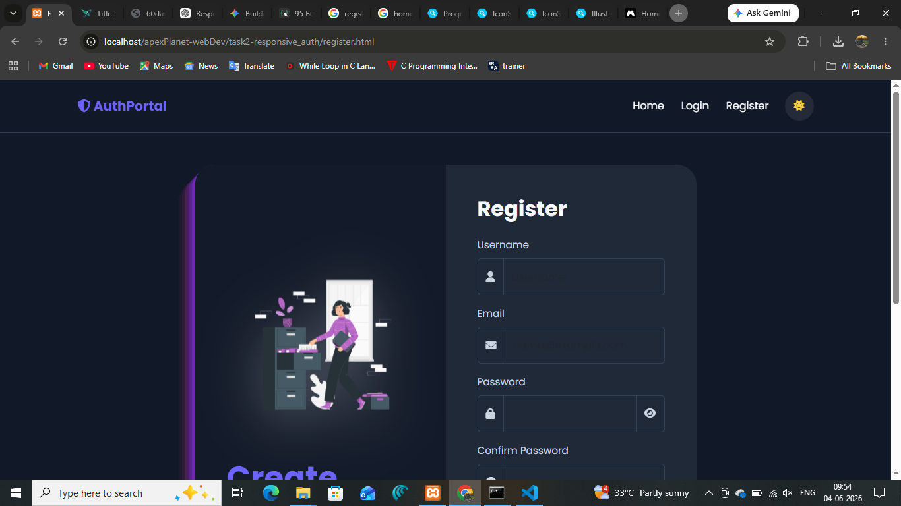
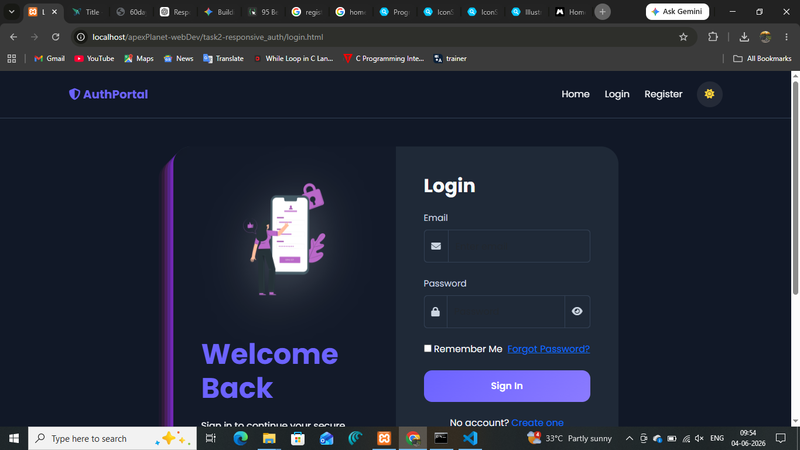

# AuthPortal

### Responsive Authentication UI

A modern and responsive authentication interface developed using **HTML, CSS, Bootstrap 5, JavaScript, AJAX, and PHP (dummy backend)**.

This project focuses on clean UI design, responsive layouts, reusable components, form validation, and frontend authentication flow.

---


# Project Screenshots

## Home Page


---

## Login Page



---

## Registration Interface

<table>
<tr>

<td width="50%" align="center">



<br><br>

Registration Screen

</td>

<td width="50%" align="center">



<br><br>

Footer Component

</td>

</tr>
</table>

---

## Dark Theme

<table>
<tr>

<td width="50%" align="center">



<br><br>

Login Theme

</td>

<td width="50%" align="center">



<br><br>

Registration Theme

</td>

</tr>
</table>

---

## Mobile Responsive View


---

## Welcome Dashboard


---

# Features

<table>

<tr>
<td>•</td>
<td>Responsive Mobile-First Interface</td>
</tr>

<tr>
<td>•</td>
<td>Bootstrap 5 Grid System</td>
</tr>

<tr>
<td>•</td>
<td>Reusable Navbar and Footer</td>
</tr>

<tr>
<td>•</td>
<td>Login and Registration Forms</td>
</tr>

<tr>
<td>•</td>
<td>JavaScript Validation</td>
</tr>

<tr>
<td>•</td>
<td>Password Visibility Toggle</td>
</tr>

<tr>
<td>•</td>
<td>Dark / Light Theme Switching</td>
</tr>

<tr>
<td>•</td>
<td>AJAX Username Availability Check</td>
</tr>

<tr>
<td>•</td>
<td>LocalStorage Authentication</td>
</tr>

<tr>
<td>•</td>
<td>Welcome Dashboard</td>
</tr>

<tr>
<td>•</td>
<td>Responsive Components</td>
</tr>

</table>

---

# Technology Stack

| Technology  | Purpose                  |
| ----------- | ------------------------ |
| HTML5       | Page Structure           |
| CSS3        | Styling                  |
| Bootstrap 5 | Responsive Layout        |
| JavaScript  | Validation & Interaction |
| AJAX        | Asynchronous Requests    |
| PHP         | Backend Simulation       |

---

# Project Structure

```plaintext
AuthPortal/
│
├── index.html
├── login.html
├── register.html
├── welcome.html
│
├── css/
│   ├── style.css
│   └── auth.css
│
├── js/
│   ├── app.js
│   ├── validation.js
│   └── ajax.js
│
├── php/
│   └── checkUser.php
│
├── components/
│   ├── navbar.html
│   └── footer.html
│
├── assets/
│   └── screenshots/
│
└── README.md
```

---


# Application Flow

```plaintext
User Registration
↓

Validation
↓

Availability Check
↓

Login Authentication
↓

Dashboard Access
↓

Logout
```

---

# Authentication Workflow

1. Create account
2. Store user information
3. Authenticate login
4. Redirect to dashboard
5. Logout session

---

# Learning Outcomes

* Responsive Design
* Component Architecture
* Frontend Authentication
* AJAX Integration
* Bootstrap Components
* Theme Management
* Form Validation

---

# Author

### Swarupa

Frontend Development • Responsive UI • JavaScript

---

# Future Enhancements

* Email Verification
* Backend Authentication
* Database Integration
* Password Recovery
* User Profiles
* Analytics Dashboard
* API Integration
